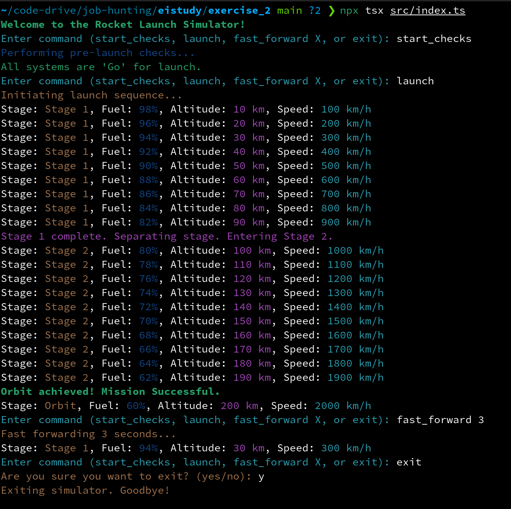

# Rocket Launch Simulator

A terminal-based rocket launch simulator implemented in TypeScript. This project simulates the process of launching a rocket, providing real-time updates on fuel, altitude, and speed, while allowing user interaction through commands.

## Features

- Simulates a rocket launch that places a satellite into orbit.
- Provides real-time updates on fuel, altitude, and speed.
- Supports user commands for pre-launch checks, launch initiation, and fast-forwarding.
- Colorful console output for better readability.
- Comprehensive error handling and logging.

## Installation

To set up the project on your local machine, follow these steps:

1. Clone the repository and navigate to the project directory:
   ```bash
   git clone <repository_url>
   cd exercise_2/
   ```

2. Install dependencies:
   ```bash
   npm install
   ```
3. Run simulation
   ```bash
   npm run start
   ```
   

### Available Commands

Once the simulator is running, you can use the following commands:

- `start_checks`: Perform pre-launch checks.
- `launch`: Initiate the launch sequence.
- `fast_forward X`: Fast forward the simulation by X seconds.
- `exit`: Exit the simulator.

## Demo


## License

This project is licensed under the MIT License - see the [LICENSE](LICENSE) file for details.